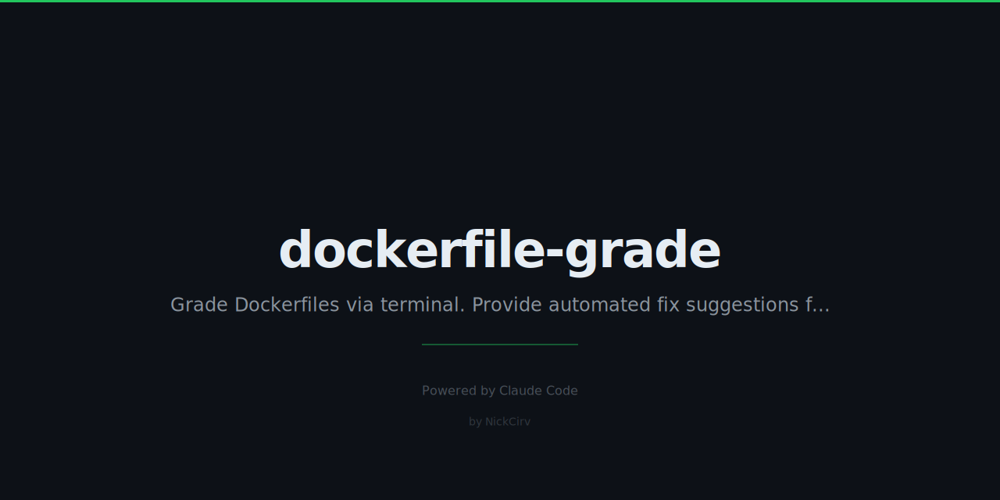

# dockerfile-grade

**Your Dockerfile just got graded.**

Stop guessing if your Dockerfile is good. Get a letter grade — A+ to F — across security, size, speed, and best practices. Share it. Fix it. Ship better images.

```
dockerfile-grade .

  DOCKERFILE-GRADE  v1.0.0

  ╔══════════════════════════════════════════╗
  ║           GRADE:  B+  (82/100)          ║
  ╚══════════════════════════════════════════╝

  Security         ████████░░  78/100
  Size             █████████░  88/100
  Speed            ███████░░░  72/100
  Best Practices   █████████░  90/100
  Documentation    ██████░░░░  60/100

  ── Issues Found ─────────────────────────────
  ✗  No USER instruction — container runs as root       [SECURITY]
  ✗  Using :latest tag on base image                    [SECURITY]
  ✗  COPY . . before package install (cache bust)       [SPEED]
  ~  No HEALTHCHECK defined                             [SECURITY]
  ~  Missing maintainer LABEL                           [BEST PRACTICES]

  ── Quick Fixes ──────────────────────────────
  Line 1:  FROM node:latest  →  Pin to node:20-alpine
  Line 12: Add USER node before CMD
  Line 5:  COPY package*.json ./ before COPY . .

  Run with --fix for full optimized Dockerfile
```

---

## The problem

hadolint gives you errors. This gives you a **grade**.

Know exactly where your Dockerfile stands, across every dimension that matters. Then fix it — with specific, actionable suggestions for every issue found.

---

## Install

```bash
npm install -g dockerfile-grade
```

Or run without installing:

```bash
npx dockerfile-grade .
```

---

## Commands

| Command | Description |
|---------|-------------|
| `dockerfile-grade .` | Grade Dockerfile in current directory |
| `dockerfile-grade path/to/Dockerfile` | Grade a specific file |
| `dockerfile-grade . --fix` | Show full optimized Dockerfile |
| `dockerfile-grade . --json` | Output results as JSON |
| `dockerfile-grade . --strict` | Exit code 1 if grade is C or below (CI mode) |

---

## What it checks

| Category | Weight | What gets graded |
|----------|--------|-----------------|
| Security | 30% | Root user, :latest tags, secrets in ENV, sudo usage, unnecessary ports, HEALTHCHECK |
| Size | 25% | Multi-stage builds, alpine/slim base, combined RUN layers, dev dependencies, cache cleanup |
| Speed | 20% | Layer ordering, build cache invalidation, BuildKit cache mounts |
| Best Practices | 15% | .dockerignore, WORKDIR, exec vs shell form, deprecated instructions, LABEL |
| Documentation | 10% | Comments, ARG for configurable values |

---

## Grade scale

| Grade | Score | What it means |
|-------|-------|---------------|
| A+ | 95–100 | Production perfect |
| A | 90–94 | Excellent |
| A- | 85–89 | Very good |
| B+ | 80–84 | Good with minor issues |
| B | 75–79 | Decent |
| B- | 70–74 | Needs some work |
| C+ | 65–69 | Several problems |
| C | 60–64 | Significant issues |
| C- | 55–59 | Poor |
| D | 45–54 | Failing |
| F | 0–44 | Start over |

---

## CI integration

Use `--strict` to block merges when Dockerfile quality drops below B:

```yaml
# .github/workflows/dockerfile-grade.yml
name: Dockerfile Grade

on: [push, pull_request]

jobs:
  grade:
    runs-on: ubuntu-latest
    steps:
      - uses: actions/checkout@v4

      - name: Install dockerfile-grade
        run: npm install -g dockerfile-grade

      - name: Grade Dockerfile
        run: dockerfile-grade . --strict
        # Exits with code 1 if grade is C or below
```

---

## JSON output

```bash
dockerfile-grade . --json
```

```json
{
  "grade": "B+",
  "score": 82,
  "categoryScores": {
    "security": 78,
    "size": 88,
    "speed": 72,
    "best-practices": 90,
    "documentation": 60
  },
  "summary": {
    "errors": 2,
    "warnings": 3,
    "info": 1,
    "total": 6
  },
  "issues": [
    {
      "id": "no-user",
      "category": "security",
      "severity": "error",
      "penalty": 15,
      "message": "No USER instruction — container runs as root",
      "fix": "Add USER instruction before CMD/ENTRYPOINT",
      "lineNumber": null
    }
  ]
}
```

---

## Why not hadolint?

hadolint is great at catching syntax errors and rule violations. Use it.

`dockerfile-grade` does something different: it gives you the **big picture grade**. See your score across 5 dimensions. Get the auto-fix suggestions. Know if you're shipping a D or an A before your image hits production.

They complement each other. Run both.

---

## License

MIT — Nicholas Ashkar, 2026
